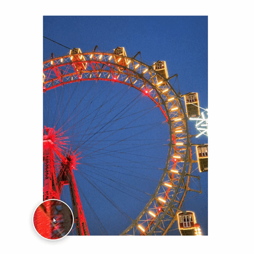

# rc-magnifier

A powerful and versatile image magnification library for React.

## Demo



## Installation

Install via npm:
```bash
npm install rc-magnifier
```

Or via yarn:
```bash
yarn add rc-magnifier
```

---

## Overview
`rc-magnifier` is a comprehensive React library for implementing various image magnification effects. It provides several specialized components to enhance user experience when viewing detailed images, ranging from standard lens magnification to advanced fullscreen manipulation.

---

## Global Configuration (Common Props)
All magnifier components share a set of base properties defined in `BaseMagnifierProps`.

| Prop | Type | Default | Description |
| :--- | :--- | :--- | :--- |
| `src` | `string` | **Required** | The main thumbnail image source. |
| `largeSrc` | `string` | `undefined` | High-resolution image source for the zoomed view. |
| `width` | `number \| string` | `'100%'` | Width of the image container. |
| `height` | `number \| string` | `'auto'` | Height of the image container. |
| `zoomFactor`| `number` | `2.5` | Initial magnification level. |
| `minZoom` | `number` | `1` | Minimum allowed zoom level (via wheel). |
| `maxZoom` | `number` | `10` | Maximum allowed zoom level (via wheel). |
| `alt` | `string` | `''` | Image alternative text for accessibility. |
| `className` | `string` | `undefined` | Custom CSS class for the container. |
| `style` | `React.CSSProperties`| `undefined` | Custom inline styles for the container. |

---

## Core Components

### 1. Magnifier
The standard magnification component with a "lens" effect.

| Prop | Type | Default | Description |
| :--- | :--- | :--- | :--- |
| `lensSize` | `number` | `120` | Size (diameter/width) of the lens or fixed panel. |
| `lensShape` | `'circle' \| 'square'` | `'circle'` | Shape of the lens when `position="follow"`. |
| `position` | `'follow' \| 'left' \| 'right' \| 'top' \| 'bottom'` | `'follow'` | Where the zoomed view appears. |
| `borderColor`| `string` | `'#fff'` | Border color of the lens/panel. |
| `borderWidth`| `number` | `3` | Border width of the lens/panel in pixels. |

#### Usage
```tsx
import { Magnifier } from 'rc-magnifier';

<Magnifier 
  src="image-thumb.jpg" 
  lensSize={150} 
  position="follow" 
/>
```

---

### 2. PiPMagnifier (Picture-in-Picture)
A magnifier where the zoomed view is pinned to a corner.

| Prop | Type | Default | Description |
| :--- | :--- | :--- | :--- |
| `pipSize` | `number` | `200` | Size of the fixed preview window. |
| `pipPosition`| `'top-left' \| 'top-right' \| 'bottom-left' \| 'bottom-right'` | `'bottom-right'` | Corner position of the PiP window. |
| `borderColor`| `string` | `'#fff'` | Border color of the PiP window. |

#### Usage
```tsx
import { PiPMagnifier } from 'rc-magnifier';

<PiPMagnifier 
  src="image-thumb.jpg" 
  pipSize={250} 
  pipPosition="top-right" 
/>
```

---

### 3. SplitMagnifier
Splits the view into a navigator and a dedicated zoom panel.

| Prop | Type | Default | Description |
| :--- | :--- | :--- | :--- |
| `splitRatio` | `number` | `0.5` | The ratio (0 to 1) between the navigator and zoom panel. |

#### Usage
```tsx
import { SplitMagnifier } from 'rc-magnifier';

<SplitMagnifier 
  src="image-thumb.jpg" 
  splitRatio={0.4} 
/>
```

---

### 4. GridMagnifier
Shows several magnification levels at once in a grid layout.

| Prop | Type | Default | Description |
| :--- | :--- | :--- | :--- |
| `levels` | `number[]` | `[1.5, 2, 3, 4]` | Array of zoom factors to display in the grid. |
| `position` | `'top' \| 'bottom' \| 'left' \| 'right'` | `'bottom'` | Grid placement relative to the image. |

#### Usage
```tsx
import { GridMagnifier } from 'rc-magnifier';

<GridMagnifier 
  src="image-thumb.jpg" 
  levels={[2, 4, 8]} 
  position="right" 
/>
```

---

### 5. FullscreenMagnifier
Opens a fullscreen overlay with image manipulation tools.

| Prop | Type | Default | Description |
| :--- | :--- | :--- | :--- |
| `triggerText` | `string` | `'🔍 Zoom'` | Text for the open button. |
| `allowZoom` | `boolean` | `true` | Enables/disables the zoom toggle button. |

#### Usage
```tsx
import { FullscreenMagnifier } from 'rc-magnifier';

<FullscreenMagnifier 
  src="image-thumb.jpg" 
  triggerText="Inspect Image" 
/>
```

---

## Technical Highlights
- **Performance**: High-quality image rendering using `image-rendering: high-quality`.
- **Responsive**: Fullscreen mode adapts to mobile screen sizes.
- **Portals**: Fixed-position panels are rendered via React Portals to ensure they stay on top of all other elements.

---
 
 ## License
 MIT © [Yusuf Yılmaz](https://github.com/yusufylmaz19)

---

## Keywords
react, next, magnifier, magnify, component, zoom, image-zoom, magnifying-glass, pip, split-view, fullscreen-magnifier, responsive, grid-zoom, rc-magnifier, image-gallery, product-view
